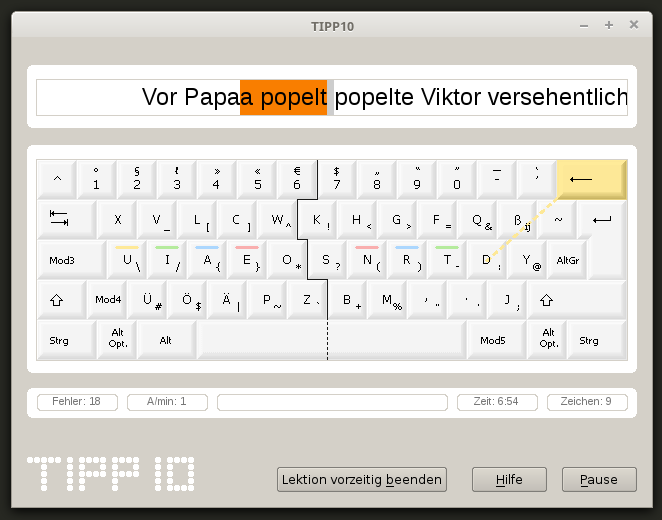

# Tipp10 - unofficial

This is a fork of the official Version V2.1.0 from https://www.tipp10.com

I improved the handling of error inputs so it immitates the behaviour of a normal text editor. 



## Video
Here you can find a demonstration on Youtube: https://youtu.be/XZ6Yd2Q7kIQ

## ONLINE Flag
Also I added a flag ```ONLINE```, which removes all the web-related functions. This was a quick fix for the transition from Qt4 to Qt5. 

## Default German
There is still a bug, so settings are not stored correctly. Therefore I removed the English language support. German is default now. This is in 
the file ```defines.h```: 

```#define APP_EXISTING_LANGUAGES_GUI	"de" // "de;en"```

